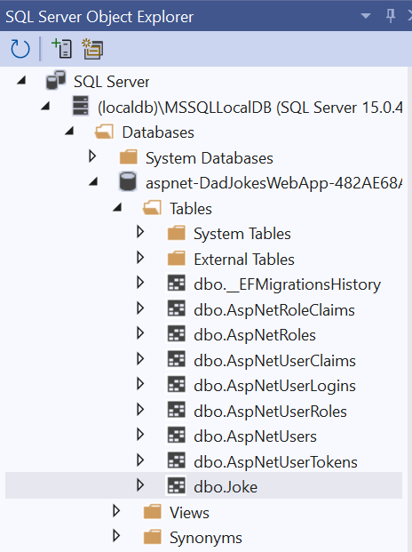

## Welcome to my Dad Jokes Web App

In its simplest form, this is a web app to display dad jokes.

### Development tutorial for noobs:

* **Basic Updates:**
  * Edit [`DadJokesWebApp/Views/Home/Index.cshtml`](Views/Home/Index.cshtml) to update home page text.
  * Edit [`DadJokesWebApp/Views/Home/Privacy.cshtml`](Views/Home/Privacy.cshtml) to update Privacy page text.

* **Create Models:**
  * Create C# classes which are essentially placeholders for data we primarily work with under [`DadJokesWebApp/Models/`](Models/)

* **Create Controllers:**
  * Right click `Controllers` in Visual Studio Solution Explorer and add a new controller. This step generates a ton of code for us.\
    **Note:** Ensure Data Context class is `DadJokesWebApp.Data.ApplicationDbContext` when adding new controller and check boxes for generate views, etc.

* **Create Database setup:**
  * Take our model built and create a database that goes behind it. We work with `"migrations"` for this.\
    Look for [`Data/Migrations/`](Data/Migrations/) in the solution explorer.
  * The Package Manager Console (can be displayed from View in Visual Studio) whose primary goal is to install new dependencies, shall be used for database management.
  * Type `add-migration "initial setup"` and hit enter, this creates a new file that'll have initial setup in its name under [`Data/Migrations/`](Data/Migrations/).\
    **Note:** initial setup can be replaced with a name of your choice.

* **Create Database:**
  * We shall now create the database using migrations. In Package Manager Console, type `update-database` and hit enter.\
    The Entity ORM (Object relation mapper) does the magic of creating all the tables for us.\
	

* **Add Jokes to Navigation Bar:**
  * Edit [`DadJokesWebApp/Views/Shared/_Layout.cshtml`](Views/Shared/_Layout.cshtml) to add Jokes to NavBar.\
    **Note:** Added asp-action as Index since that is referenced by Jokes Controller.

* **Add Search Functionality for Jokes:**
  * Edit [`DadJokesWebApp/Views/Shared/_Layout.cshtml`](Views/Shared/_Layout.cshtml) to add Search to NavBar.
  * Update [`Controllers/JokesController.cs`](Controllers/JokesController.cs) to handle Search functionality.
  * Create a corresponding View for Search Functionality.
    * Just right click ShowSearchForm method in [`Controllers/JokesController.cs`](Controllers/JokesController.cs) and select Add Controller.
	* The closest view would be that of Create since it accepts data (search also accepts data, as in what to search for). We'd need to edit the generated view though to reflect search functionality.
	* We're not creating a new Joke so model in top line of ShowSearchForm.cshtml was deleted. 
	* Last three lines for validating entered jokes are deleted as they're not required.
	* Update [`Controllers/JokesController.cs`](Controllers/JokesController.cs) to add functionality to return search results.

	
	
  
